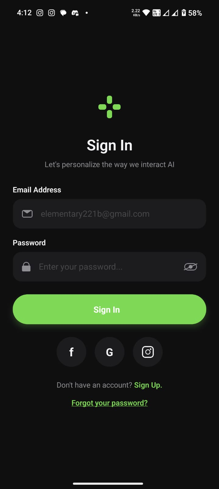
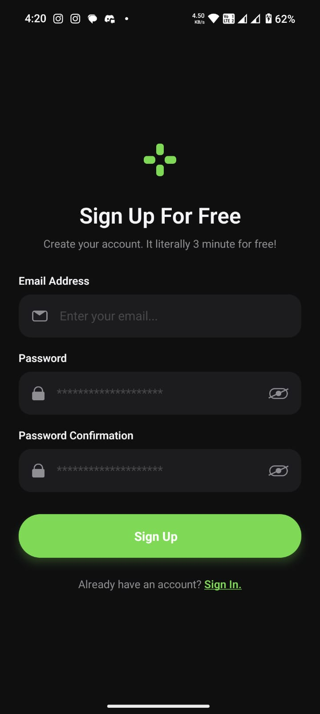
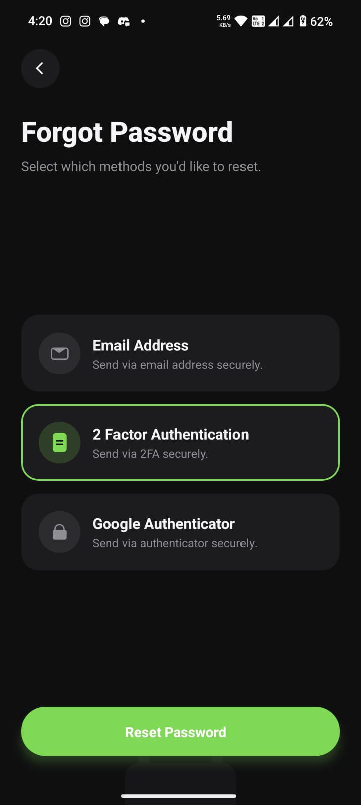

# Auth Screens — React Native + Expo

Three dark-mode auth screens (Sign In, Sign Up, Forgot Password) built with only React Native primitives. Every icon is hand-built from `View` shapes — no SVG, no icon library.

## Screenshots

| Sign In | Sign Up | Forgot Password |
| :---: | :---: | :---: |
|  |  |  |

## Stack

- Expo (expo-router, file-based routing)
- React Native
- TypeScript

## Run

```bash
npm install
npx expo start
```

Then press `i` for iOS, `a` for Android.

## Structure

```
app/                       Route entry files (one-line re-exports)
  _layout.tsx              Root stack + dark theme + SafeAreaProvider
  index.tsx                → SignIn
  signup.tsx               → SignUp
  forgot-password.tsx      → ForgotPassword
components/
  SignIn.tsx
  SignUp.tsx
  ForgotPassword.tsx
  icons.tsx                Logo, MailIcon, LockIcon, EyeIcon, etc.
```

## Constraint

Imports limited to: `View`, `Text`, `TextInput`, `Pressable`, `ScrollView`, `KeyboardAvoidingView`, `Platform` from `react-native`, and `SafeAreaView` from `react-native-safe-area-context`.
